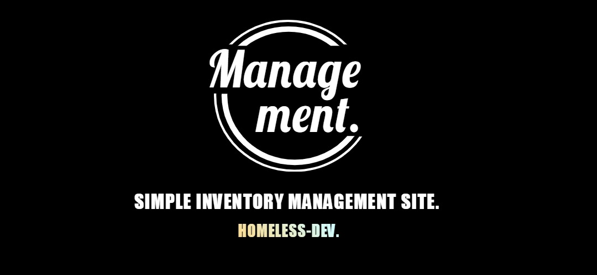

# Management-Solution

 **This Project is Simple inventory management site for managers using jsp model1.**
    
    1. 환경 및 기술스택
        (1). Server 
             - Apache tomcat 8.5
        (2). DataBase
             - MySQL8.0
        (3). JDK
             - jdk1.8.0
        (4). layout & Front-end 
             - html5, css, javaScript
        (5). Back-end
             - Java(Java servlet, JSP)             
        (6). IDE(Integrated development environment)
             - eclipse
             
    2. 기능
        (1). Login
            a. Login session 유지
            b. SignUp
            c. Logout시 세션 종료
            
        (2). List
           a. 데이터 추가
           b. 데이터 조회
           c. 데이터 삭제
           d. 데이터 검색
           e. Login session 유지
